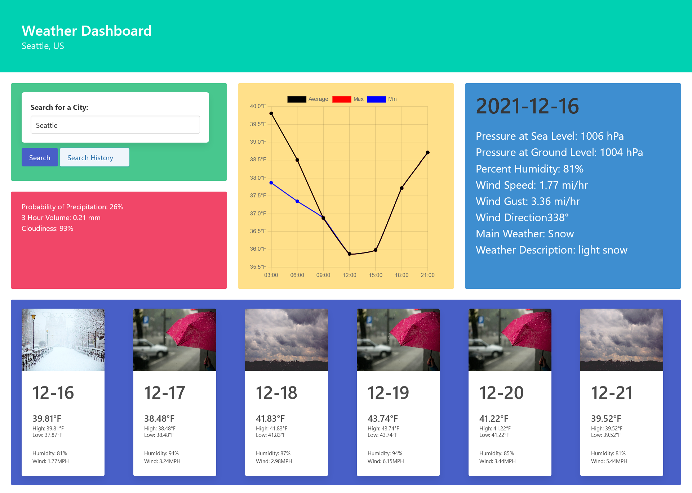

# Weather Dashboard
A website that shows you a small 5-day weather overview of a city that the user inputs.

## Description
This website pulls from the Open Weather API to show the weather forcast of a city that the user inputs the name of. The weather report consists of the next 5 days from today. There is a featured block that shows a more detailed view of the specific day that the user selects broken down into 3-hour intervals.

## Table of Contents
- [Description](#description)
- [Weather Dashboard Website Preview](#weather-dashboard-website-preview)
- [Overview](#overview)
- [Bulma](#bulma)
- [Chart.js](#chartjs)
- [Conclusion](#conclusion)

## Weather Dashboard Website Preview

Click to Reveal

Click the preview to be redirected to the website!

## Overview
This project's main focus is using third party server apis. For this project I have chosen Open Weather API since it was well documented and seemed very beginner friendly. Implementing the fetch function was more challenging than I was expecting. Since this was the first time I did something like this I didn't know where to start and I had no idea how to correct the bugs that I ran into. For example I had to get use to the promise and response object types and working with the .then() function in order to properly retrieve data from the API. 
I also wanted to challenge myself by using another third party api to try and get used to reading and using API documentation. The easiest and most applicable api I found was Bulma and Chart.js. 

## Bulma

Bulma is a framework API that is similar to Bootstrap. It is minimal, 2D, and has a lot of easy to use tools to make the webpage visually appealing. Organizing sections using their tile feature built off of flexbox was a simple experience that led to a great product. 

## Chart.js

Chart.js is a api that creates appealing and clear graphs for any dataset I provide it. It's ease of you and functionaly really helped add to my webpage. Recently they added an update function that made it easy and simple to swap between datasets for the different days. 

## Conclusion

This project was a great introduction to third party server apis. A great tool that I found was Insomnia and the browser console. Insomnia allowed me to visually parse the data object that I recieved from the server and the browser console gave me a interactive way to drill into the object and showed me where I was, allowing me to select what I wanted with ease. I find myself much more confident in using server apis.

## Sources

Click to Reveal

Photo by <a href="https://unsplash.com/@epicantus?utm_source=unsplash&utm_medium=referral&utm_content=creditCopyText">Daria Nepriakhina</a> on <a href="https://unsplash.com/s/photos/cloudy?utm_source=unsplash&utm_medium=referral&utm_content=creditCopyText">Unsplash</a>
  

Photo by <a href="https://unsplash.com/@thebeardbe?utm_source=unsplash&utm_medium=referral&utm_content=creditCopyText">Filip Bunkens</a> on <a href="https://unsplash.com/s/photos/snow?utm_source=unsplash&utm_medium=referral&utm_content=creditCopyText">Unsplash</a>
  

Photo by <a href="https://unsplash.com/@ritambaishya?utm_source=unsplash&utm_medium=referral&utm_content=creditCopyText">Ritam Baishya</a> on <a href="https://unsplash.com/s/photos/clear-sky?utm_source=unsplash&utm_medium=referral&utm_content=creditCopyText">Unsplash</a>
  

Photo by <a href="https://unsplash.com/@ewitsoe?utm_source=unsplash&utm_medium=referral&utm_content=creditCopyText">Erik Witsoe</a> on <a href="https://unsplash.com/s/photos/rain-umbrella?utm_source=unsplash&utm_medium=referral&utm_content=creditCopyText">Unsplash</a>
  

