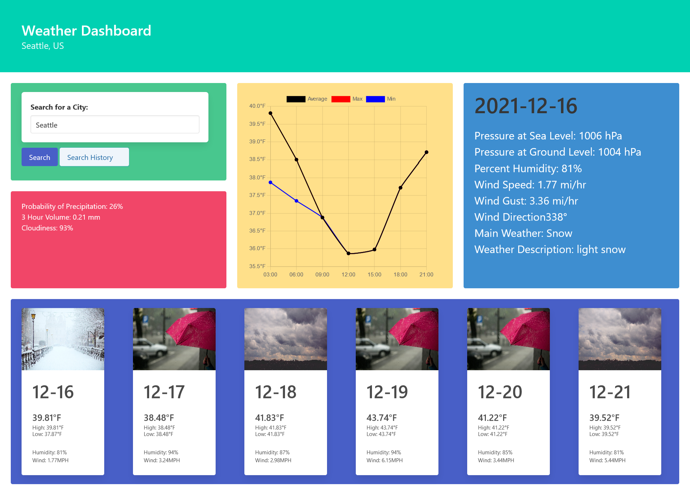

# Weather Dashboard

A 5-day weather forecast app that lets users search any city and view detailed conditions broken down by 3-hour intervals.

🔗 **Live Demo:** [Weather Dashboard](https://jonathan6.github.io/Weather-Dashboard/)

---

## Built With

- **Languages:** HTML, CSS, JavaScript
- **Frameworks / Libraries:** [Bulma](https://bulma.io/), [Chart.js](https://www.chartjs.org/)
- **APIs:** [OpenWeather API](https://openweathermap.org/api)

---

## How It's Made

The core of this project is a fetch call to the OpenWeather API, which returns a forecast object broken into 3-hour intervals across 5 days. The app parses that response and renders a summary card for each day, with a featured detail view that populates when the user selects a specific day.

Working with the API's promise-based response was the steepest part of the build. Coming in without prior experience with fetch, I had to get comfortable with the Promise and Response object types and chaining `.then()` calls correctly before I could reliably extract the data I needed. Using Insomnia to visually parse the raw API response was a game-changer — it let me map out the object structure before writing a single line of parsing logic.

For layout and styling I used Bulma, a lightweight flexbox-based CSS framework. Its tile system made it straightforward to build the card grid without writing a lot of custom CSS. Chart.js was layered on top to visualize the forecast data as a graph for each selected day — its built-in `update()` method made swapping between day datasets clean and simple.

---

## Optimizations

Chart.js's `update()` method was a meaningful find here. Rather than destroying and re-rendering the chart every time a user selects a new day, calling `update()` on the existing chart instance swaps the dataset in place — no flicker, no DOM thrash.

---

## Lessons Learned

This project was my first real experience working with third-party server APIs end-to-end. A few specific takeaways:

- **Promises and async data flow** — I had a surface-level understanding of `.then()` coming in. Debugging a real API response forced me to actually internalize how the Promise chain works and where errors surface.
- **Reading API documentation** — The OpenWeather docs are well-structured, but I still had to slow down and read carefully to understand the difference between the current weather endpoint and the 5-day forecast endpoint. That patience paid off.
- **Insomnia as a development tool** — Having a dedicated API client to inspect raw responses before writing any parsing code made the whole process faster and less frustrating. It's now a permanent part of my workflow.

---

## Acknowledgments

- [OpenWeather API](https://openweathermap.org/api)
- [Bulma CSS Framework](https://bulma.io/)
- [Chart.js](https://www.chartjs.org/)
- Photo by [Daria Nepriakhina](https://unsplash.com/@epicantus) on Unsplash — cloudy sky
- Photo by [Filip Bunkens](https://unsplash.com/@thebeardbe) on Unsplash — snow
- Photo by [Ritam Baishya](https://unsplash.com/@ritambaishya) on Unsplash — clear sky
- Photo by [Erik Witsoe](https://unsplash.com/@ewitsoe) on Unsplash — rain
